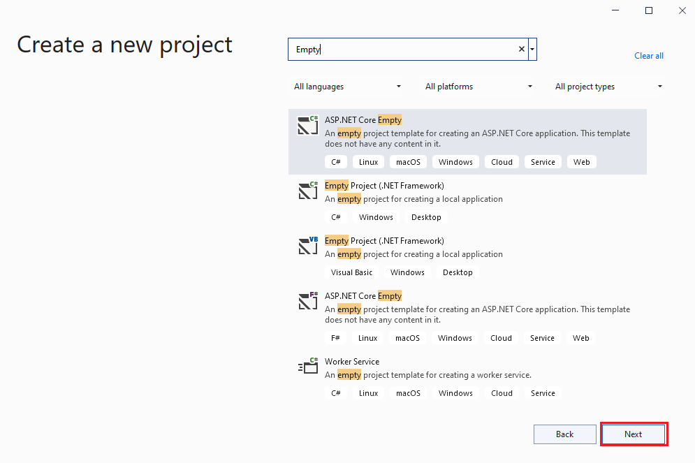
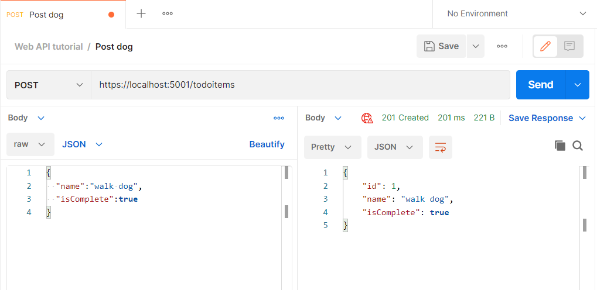
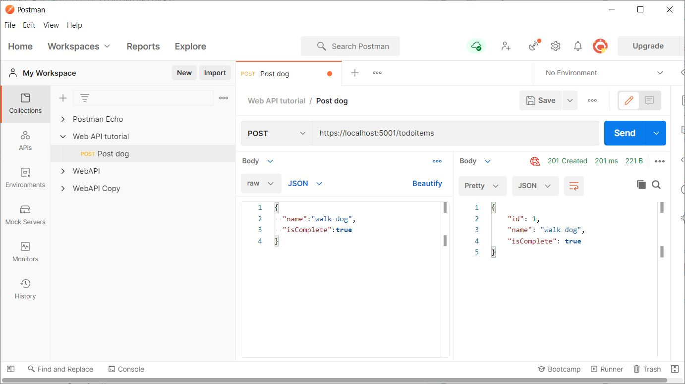

# Tutorial: Create a web minimal API with ASP.NET Core

<!-- TODO: Remove aspnetcore\tutorials\min-web-api\samples\6.x -->
By [Rick Anderson](https://twitter.com/RickAndMSFT)

Minimal APIs are architected to create REST APIs with the minimal dependencies. They are ideal for microservices and apps that want to include only the minimum files, features, and dependencies in ASP.NET Core.

This tutorial teaches the basics of building a miminal web API with ASP.NET Core. For a tutorial on creating a web API project that contains more features, see [Create a web API](xref:tutorials/first-web-api)

## Overview

This tutorial creates the following API:

|API | Description | Request body | Response body |
|--- | ---- | ---- | ---- |
|`GET /` | Browser test, "Hello World" | None | Hello World!|
|`GET /todoitems` | Get all to-do items | None | Array of to-do items|
|`GET /todoitems/complete` | Get completed to-do items | None | Array of to-do items|
|`GET /todoitems/{id}` | Get an item by ID | None | To-do item|
|`POST /todoitems` | Add a new item | To-do item | To-do item |
|`PUT /todoitems/{id}` | Update an existing item &nbsp; | To-do item | None |
|`DELETE /todoitems/{id}` &nbsp; &nbsp; | Delete an item &nbsp; &nbsp; | None | None|

## Prerequisites

# [Visual Studio](#tab/visual-studio)

[!INCLUDE[](~/includes/net-prereqs-vs-6.0.md)]

# [Visual Studio Code](#tab/visual-studio-code)

[!INCLUDE[](~/includes/net-prereqs-vsc-6.0.md)]

<!-- add VS Mac later
# [Visual Studio for Mac](#tab/visual-studio-mac)

[!INCLUDE[](~/includes/net-prereqs-mac-6.0.md)]
-->
---

## Create an empty web project

# [Visual Studio](#tab/visual-studio)

* Start Visual Studio 2022 and select **Create a new project**
  
* In the **Create a new project** dialog:
  * Enter `Empty` in the **Search for templates** search box.
  * Select the **ASP.NET Core Empty** template and select **Next**.
  
* Name the project *TodoApi* and select **Next**.
* In the **Additional information** dialog, select **.NET 6.0 (Preview)** and select **Create**.
 
<!-- 

-->

<!-- Move this later since we don't need it now -->
# [Visual Studio Code](#tab/visual-studio-code)

* Open the [integrated terminal](https://code.visualstudio.com/docs/editor/integrated-terminal).
* Change directories (`cd`) to the folder that will contain the project folder.
* Run the following commands:

   ```dotnetcli
   dotnet new web -o TodoApi
   cd TodoApi
   code -r ../TodoApi
   ```

* When a dialog box asks if you want to add required assets to the project, select **Yes**.

  The preceding command creates a new web API project and opens it in Visual Studio Code. 

<!-- add VS Mac later 
# [Visual Studio for Mac](#tab/visual-studio-mac)

* Select **File** > **New Solution**.

`  `

* In Visual Studio for Mac earlier than version 8.6, select **.NET Core** > **App** > **API** > **Next**. In version 8.6 or later, select **Web and Console** > **App** > **API** > **Next**.

`  `

* In the **Configure the new ASP.NET Core Web API** dialog, select the latest .NET Core 5.x **Target Framework**. Select **Next**.

* Enter *TodoApi* for the **Project Name** and then select **Create**.

 ` `

[!INCLUDE[](~/includes/mac-terminal-access.md)]
-->
---

### Examine the code

The *Program.cs* file contains the following code:

[!code-csharp[](min-web-api/samples/6.x/Program.cs)]

The following code create a `WebApplicationBuilder` with preconfigured defaults, and builds the web app:

  ```csharp
  var builder = WebApplication.CreateBuilder(args);
  var app = builder.Build();
  ```

`app.MapGet("/", () => "Hello World!");`  maps the `/` endpoint to a method that returns `Hello World!`.

`app.Run();` runs the app.

The preceding code is a complete web app with one endpoint.

### Run the app

# [Visual Studio](#tab/visual-studio)

Press Ctrl+F5 to run without the debugger.

[!INCLUDE[](~/includes/trustCertVS22.md)]

Visual Studio launches:

* The [Kestrel web server](xref:fundamentals/servers/kestrel).
* The default browser and navigates to `https://localhost:5001`.

# [Visual Studio Code](#tab/visual-studio-code)

[!INCLUDE[](~/includes/trustCertVSC.md)]

Press Ctrl+F5 to run the app. In a browser, go to following URL: [https://localhost:5001](https://localhost:5001)

<!-- add VS Mac later 
# [Visual Studio for Mac](#tab/visual-studio-mac)

Select **Run** > **Start Debugging** to launch the app. Visual Studio for Mac launches a browser and navigates to `https://localhost:<port>`, where `<port>` is a randomly chosen port number. 
-->

---

`Hello World!` is displayed in the browser.

## Add NuGet packages

NuGet packages must be added to support the database and diagnostics used in this tutorial.

# [Visual Studio](#tab/visual-studio)

* From the **Tools** menu, select **NuGet Package Manager > Manage NuGet Packages for Solution**.
* Select the **Browse** tab, and then enter `Microsoft.EntityFrameworkCore.InMemory` in the search box. Verify **Include prerelease** is checked.
* Enter **Microsoft.EntityFrameworkCore.InMemory** in the search box, and then select `Microsoft.EntityFrameworkCore.InMemory`.
* Select the **Project** checkbox in the right pane and then select **Install**.
* Follow the preceding instructions to add the `Microsoft.AspNetCore.Diagnostics.EntityFrameworkCore` package.

# [Visual Studio Code](#tab/visual-studio-code)

* Run the following commands:

   ```dotnetcli
   dotnet add package Microsoft.EntityFrameworkCore.InMemory --prerelease
   dotnet add package Microsoft.AspNetCore.Diagnostics.EntityFrameworkCore --prerelease
     ```

<!-- add VS Mac later 
# [Visual Studio for Mac](#tab/visual-studio-mac)

Open a command terminal in the project folder and run the following command:

   ```dotnetcli
   dotnet add package Microsoft.EntityFrameworkCore.InMemory
   ```
   -->
---

## Add the API code

Replace the contents of the *program.cs* file with the following code:

[!code-csharp[](min-web-api/samples/6.x/todo/Program.cs?name=snippet_all)]

## The model and database context classes

The preceding code contains the following model:

[!code-csharp[](min-web-api/samples/6.x/todo/Program.cs?name=snippet_model)]

A *model* is a set of classes that represent the data that the app manages. The model for this app is the `Todo` class.

The sample app contains the following database context class:

[!code-csharp[](min-web-api/samples/6.x/todo/Program.cs?name=snippet_cntx)]

The *database context* is the main class that coordinates [Entity Framework](/ef/core/) functionality for a data model. This class is created by deriving from the <xref:Microsoft.EntityFrameworkCore.DbContext?displayProperty=fullName> class.

The following highlighted code adds the database context to the [dependency injection (DI)](xref:fundamentals/dependency-injection) container:

[!code-csharp[](min-web-api/samples/6.x/todo/Program.cs?name=snippet_DI&highlight=3)]

 The DI container provides access to the database context and other services.

## Install Postman to test the app

This tutorial uses Postman to test the API.

* Install [Postman](https://www.getpostman.com/downloads/)
* Start the web app.
* Start Postman.
* Disable **SSL certificate verification**
  * From **File** > **Settings** (**General** tab), disable **SSL certificate verification**.
    > [!WARNING]
    > Re-enable SSL certificate verification after testing the controller.

<a name="post"></a>

### Test posting data

The following instructions post data to the app:

  * Create a new request.
  * Set the HTTP method to `POST`.
  * Set the URI to `https://localhost:<port>/todoitems`. For example: `https://localhost:5001/todoitems`
  * Select the **Body** tab.
  * Select the **raw** radio button.
  * Set the type to **JSON (application/json)**.
  * In the request body enter JSON for a to-do item:
  
      ```json
      {
        "name":"walk dog",
        "isComplete":true
      }
      ```
  
  * Select **Send**.
    
    <!--  -->

## Examine the GET methods

Several GET endpoints are implemented:

|API | Description | Request body | Response body |
|--- | ---- | ---- | ---- |
|`GET /` | Browser test, "Hello World" | None | `Hello World!`|
|`GET /todoitems` | Get all to-do items | None | Array of to-do items|
|`GET /todoitems/{id}` | Get an item by ID | None | To-do item|

[!code-csharp[](min-web-api/samples/6.x/todo/Program.cs?name=snippet_get)]

## Test Get

Test the app by calling the two endpoints from a browser or Postman. For example:

* `https://localhost:5001/todoitems`
* `https://localhost:5001/todoitems/1`

A response similar to the following is produced by the call to `Gettodoitems`:

```json
[
  {
    "id": 1,
    "name": "Item1",
    "isComplete": false
  }
]
```

### Test Get with Postman

* Create a new request.
* Set the HTTP method to **GET**.
* Set the request URI to `https://localhost:<port>/todoitems`. For example, `https://localhost:5001/todoitems`.
* Select **Send**.

This app uses an in-memory database. If the app is stopped and started, the preceding GET request will not return any data. If no data is returned, [POST](#post) data to the app.

## Return values

ASP.NET Core automatically serializes the object to [JSON](https://www.json.org) and writes the JSON into the body of the response message. The response code for this return type is [200 OK](https://developer.mozilla.org/docs/Web/HTTP/Status/200), assuming there are no unhandled exceptions. Unhandled exceptions are translated into 5xx errors.

The return types can represent a wide range of HTTP status codes. For example, `GetTodoItem/{id}` can return two different status values:

* If no item matches the requested ID, the method returns a [404 status](https://developer.mozilla.org/docs/Web/HTTP/Status/404) <xref:Microsoft.AspNetCore.Mvc.ControllerBase.NotFound%2A> error code.
* Otherwise, the method returns 200 with a JSON response body. Returning `item` results in an HTTP 200 response.

## Put methods

Examine the `MapPut` method:

[!code-csharp[](min-web-api/samples/6.x/todo/Program.cs?name=snippet_put)]

This method is similar to the `MapPost`, except it uses HTTP PUT. The response is [204 (No Content)](https://www.w3.org/Protocols/rfc2616/rfc2616-sec9.html). According to the HTTP specification, a PUT request requires the client to send the entire updated entity, not just the changes. To support partial updates, use [HTTP PATCH](xref:Microsoft.AspNetCore.Mvc.HttpPatchAttribute).

### Test MapPut

This sample uses an in-memory database that must be initialized each time the app is started. There must be an item in the database before you make a PUT call. Call GET to ensure there's an item in the database before making a PUT call.

Update the to-do item that has Id = 1 and set its name to `"feed fish"`:

```json
  {
    "Id":1,
    "name":"feed fish",
    "isComplete":false
  }
```

<!--
The following image shows the Postman update:
 
``
-->

## The MapDelete method

Examine the `MapDelete` method:

[!code-csharp[](min-web-api/samples/6.x/todo/Program.cs?name=snippet_delete)]


Use Postman to delete a to-do item:

* Set the method to `DELETE`.
* Set the URI of the object to delete (for example `https://localhost:5001/todoitems/1`).
* Select **Send**.

<a name="over-post-v6"></a>

## Prevent over-posting

Currently the sample app exposes the entire `Todo` object. Production apps typically limit the data that's input and returned using a subset of the model. There are multiple reasons behind this and security is a major one. The subset of a model is usually referred to as a Data Transfer Object (DTO), input model, or view model. **DTO** is used in this article.

A DTO may be used to:

* Prevent over-posting.
* Hide properties that clients are not supposed to view.
* Omit some properties in order to reduce payload size.
* Flatten object graphs that contain nested objects. Flattened object graphs can be more convenient for clients.

To demonstrate the DTO approach, update the `Todo` class to include a secret field:

[!code-csharp[](min-web-api/samples/6.x/todoDTO/Program.cs?name=snippet_secret&highlight=7)]

The secret field needs to be hidden from this app, but an administrative app could choose to expose it.

Verify you can post and get the secret field.

Create a DTO model:

[!code-csharp[](min-web-api/samples/6.x/todoDTO/Program.cs?name=snippet_DTO)]

Update the code to use `TodoItemDTO`:

[!code-csharp[](min-web-api/samples/6.x/todoDTO/Program.cs?name=snippet_all)]

Verify you can't post or get the secret field.

## Use JsonOptions

The following code uses <xref:Microsoft.AspNetCore.Http.Json.JsonOptions>:

[!code-csharp[](min-web-api/samples/6.x/WebMinJson/Program.cs?name=snippet_1)]

The following code uses <xref:System.Text.Json.JsonSerializerOptions>:

[!code-csharp[](min-web-api/samples/6.x/WebMinJson/Program.cs?name=snippet_2)]

## Test minimal API

For an example of testing a minimal API app, see [this GitHub sample](https://github.com/davidfowl/CommunityStandUpMinimalAPI/blob/davidfowl/rc1/TodoApi.Tests/TodoTests.cs).
